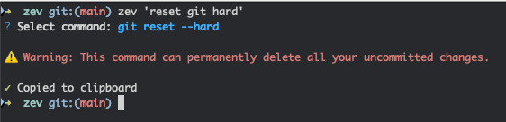

# Zev 🔍

[](https://badge.fury.io/py/zev)
[](https://opensource.org/licenses/MIT)

Zev helps you remember (or discover) terminal commands using natural language.


## 🔧 Installation

```bash
pip install zev
```

This project runs on top of the OpenAI API. After your first time running it, you will be prompted to enter an OpenAI key.

## 🎮 Usage

#### Option 1: Interactive Mode

```bash
zev
```

#### Option 2: Direct Query

```bash
zev '<what you want to do>'
```

## 📝 Examples

```bash
# Find running processes
zev 'show all running python processes'

# File operations
zev 'find all .py files modified in the last 24 hours'

# System information
zev 'show disk usage for current directory'

# Network commands
zev 'check if google.com is reachable'

# Git operations
zev 'show uncommitted changes in git'
```

## 🛡️ Safety Considerations

⚠️ Commands are generated by LLMs. While the tool attempts to flag dangerous commands, it may not always do so. Use caution.



## ⚙️ Settings

You can update your OpenAI API key or other settings by running:

```bash
zev --setup
```

To use the OpenAI key, you must have an OpenAI account and a subscription. You can create an API key on [this page](https://platform.openai.com/settings/organization/api-keys).

## 🐪 Using with Ollama

You can use Zev with [Ollama](https://ollama.ai/) as an alternative to OpenAI, which lets you run all commands locally. To set this up:

1. Install and start [Ollama](https://ollama.com/) with a model of your choice

2. Run `zev --setup` and put in the proper settings. For example:

```
? Pick your LLM provider: Ollama
? Enter the Ollama URL: http://localhost:11434/v1
? Enter the model to use (e.g. llama3.2): llama3.2
```

Note that to switch backends, you can re-run `zev --setup` again at any time.

## 🤝 Contributing

Contributions are welcome! Feel free to open issues or submit pull requests.

## 📄 License

This project is licensed under the MIT License - see the [LICENSE](LICENSE) file for details.
